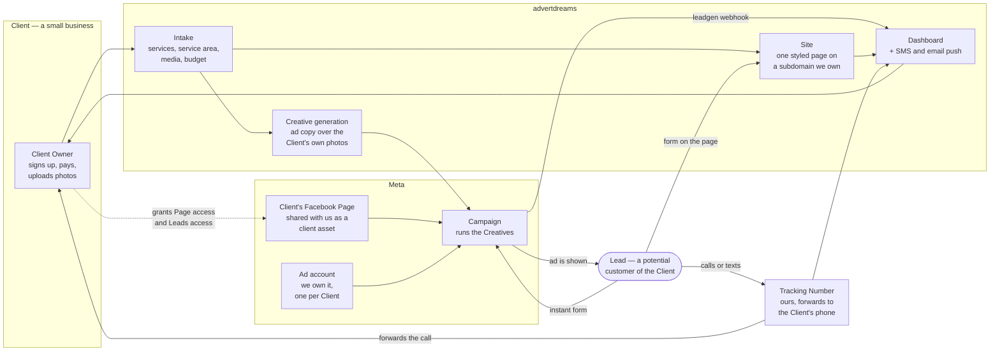

# advertdreams

End-to-end marketing for US small businesses — mom-and-pop shops and owner-operators, not enterprise.

A business subscribes. advertdreams hosts a web presence for them, turns their own photos and videos into advertisements, publishes and manages those ads, captures the leads, and hands them back through a dashboard. One subscription covers everything, ad spend included.

**This repo is planning, not product.** No application code is written yet. The work happening here is deciding the product shape and business model, one resolved question at a time, in GitHub Issues. See [Where the thinking lives](#where-the-thinking-lives).

## How it fits together

Three ways a Lead arrives, and they are not interchangeable. Meta's instant forms are the only path carrying per-lead attribution back to the ad that produced it. The form on the Site gets higher-intent leads but cannot prove which ad sent them. The Tracking Number is the only thing that can attribute a phone call, which is why it is mandatory rather than an upsell.

## How the money works

- The Client pays **a subscription only**. No per-lead fee — that invites a monthly argument about what counts as a lead.
- **advertdreams funds the ad spend** out of its own ad account and recovers it in the subscription price. Ad spend is a cost of goods, not a pass-through.
- Every tier therefore carries a **hard cap on ad spend**. Pricing has to cover it.

## What v1 is

- **Meta only.** TikTok is second, and no decision may foreclose it.
- **Civil construction only** as the first vertical. A vertical is data — intake questions, service vocabulary, prompt templates — not code, so adding salons later means adding records.
- **One styled page** for the Site, chosen from a handful of ready-made styles, on a subdomain advertdreams owns. It must be able to grow into a real multi-page site later without a redesign. A Client's own domain is an upgrade, never the onboarding path.
- **Self-serve signup, async activation.** The Client signs up and pays on the web; ad account creation and phone number registration finish in hours or days, so the dashboard needs an honest "being set up" state.
- **Creative approval by silence.** New creatives queue and publish themselves after 48 hours unless the Client kills them — one notification, one tap. The veto is real and necessary: the model invents a false claim about once per run.

## Where the thinking lives

| What | Where |
|---|---|
| Vocabulary — what a Client, Lead, Creative, Site, Tier actually mean | [`CONTEXT.md`](CONTEXT.md) |
| The open questions and everything settled so far | [Issue #2, the wayfinder map](https://github.com/TempleZide/advertdreams/issues/2) |
| Research findings behind the settled decisions | [`docs/research/`](docs/research/) |
| Recorded architecture decisions | [`docs/adr/`](docs/adr/) |
| How agents should work in this repo | [`docs/agents/`](docs/agents/), [`CLAUDE.md`](CLAUDE.md) |

**Start with the map.** Issue #2 holds the standing constraints, one line per resolved question, and what is deliberately still open. Several plausible ideas — per-lead pricing, a multi-page website builder, TikTok at launch, Client-funded ad spend — are already ruled out or deferred there. Read its Notes before proposing anything.
